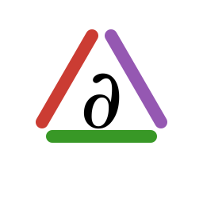

# AutomaticCalculus



Small Julia helpers for calculus-style notation backed by automatic differentiation.

## Installation

```julia
using Pkg
Pkg.add("AutomaticCalculus")
```

## Examples

```julia
using AutomaticCalculus
using StaticArrays

f(x) = x[1]^2 + 3x[1] * x[2] + x[2]^2
x = @SVector [2.0, 5.0]

∂(f, 1, x)    # 19.0
∂(f, 2, x)    # 16.0
∇(f, x)    # (19.0, 16.0)
```

Operators can also be partially applied.

```julia
dfdx = ∂(f, 1)
dfdx(x)       # 19.0

∇f = ∇(f)
∇f(x)   # (19.0, 16.0)
```

Second derivatives and weighted Laplacian-style sums are available through `∂∂` and `Δ`.

```julia
σ(x) = one(eltype(x))

∂∂(f, 1, 1, x)  # 2.0
∂∂(f, 1, 2, x)  # 3.0
Δ(f, σ, x)      # 4.0
```

For vector-valued functions, `divergence` computes the divergence.

```julia
u(x) = @SVector [x[1]^2, x[1] * x[2]]

divergence(u, x)    # 6.0
∇ ⋅ (u, x)          # 6.0
```

## Running Tests

Run the package test suite with `Pkg.test`:

```julia
using Pkg
Pkg.test("AutomaticCalculus")
```

The test run includes the normal package tests plus Aqua and JET checks.
To skip the Aqua and JET suites, pass `test_args`:

```julia
Pkg.test("AutomaticCalculus"; test_args=["--skip-aqua-jet"])
```

You can also skip them individually:

```julia
Pkg.test("AutomaticCalculus"; test_args=["--skip-aqua"])
Pkg.test("AutomaticCalculus"; test_args=["--skip-jet"])
```

## Documentation

The docs are built with `Documenter.jl` into HTML under `docs/build/`.
Build them from the repository root with:

```julia
julia --project=docs docs/make.jl
```

To build and open the generated HTML in your browser:

```julia
julia --project=docs docs/make.jl --open
```
